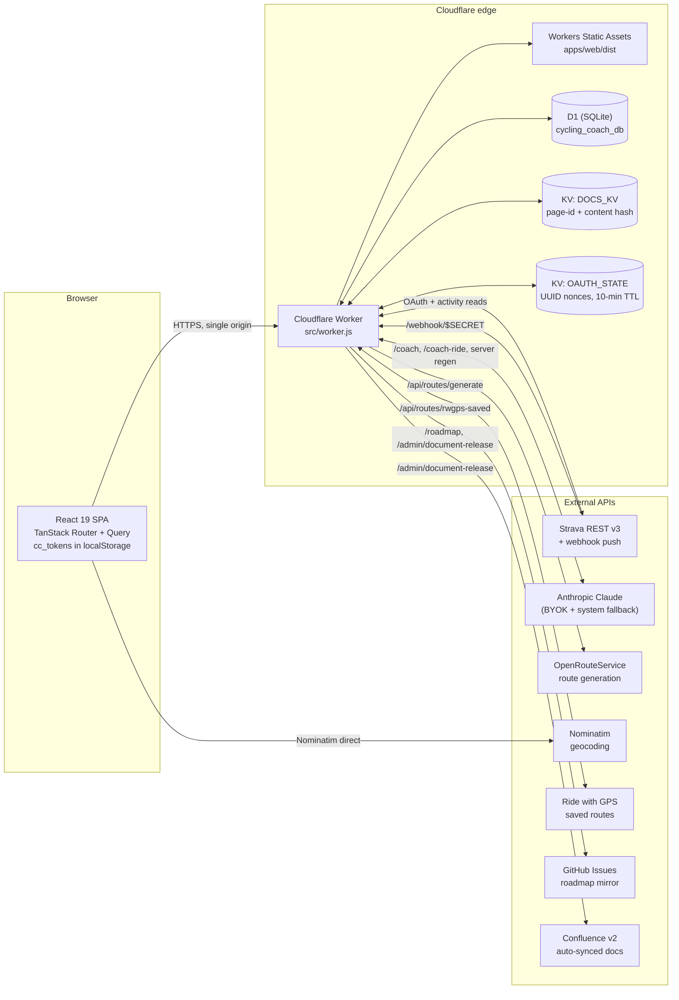
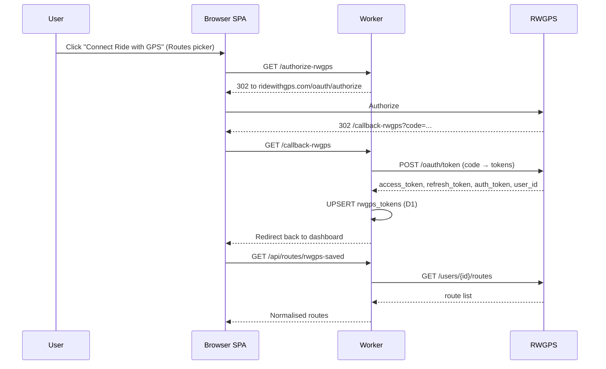
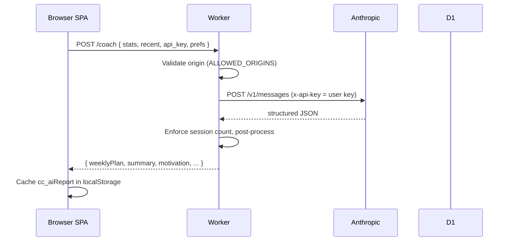
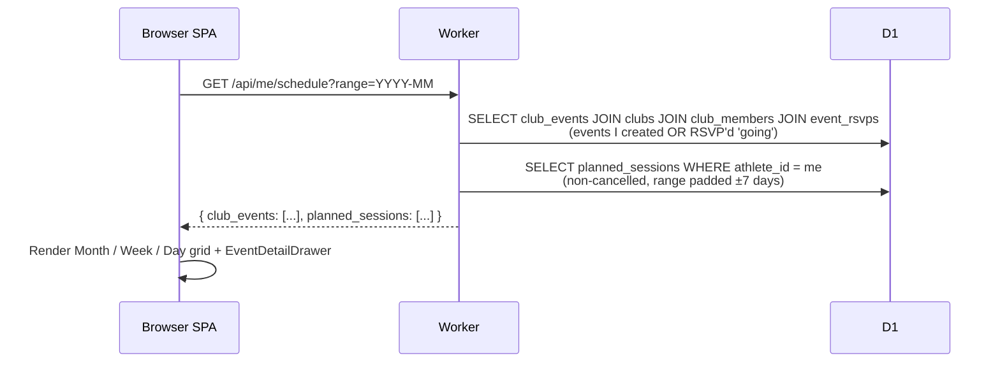
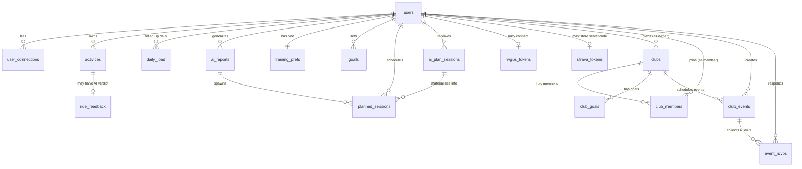

# Cadence Club

Performance-training platform for serious cyclists and the clubs they ride with. Cadence Club ingests your Strava history, computes daily form (CTL/ATL/TSB) at the edge, generates AI-coached weekly plans, and gives clubs a shared schedule with RSVP and AI-drafted weekly recaps.

**Live:** [cycling-coach.josem-reboredo.workers.dev](https://cycling-coach.josem-reboredo.workers.dev) · **Current release:** [v10.12.0](./CHANGELOG.md) · **Security policy:** [SECURITY.md](./SECURITY.md) · **Contributing:** [CONTRIBUTING.md](./CONTRIBUTING.md)

---

## Table of contents

1. [What it does](#what-it-does)
2. [Tech stack](#tech-stack)
3. [Architecture](#architecture)
4. [Data flows](#data-flows)
5. [Routes](#routes)
6. [Components](#components)
7. [Data model](#data-model)
8. [Local development](#local-development)
9. [Deploy and on-call](#deploy-and-on-call)
10. [Recent releases](#recent-releases)
11. [Roadmap](#roadmap)
12. [Contributing](#contributing)
13. [License](#license)

---

## What it does

- **Daily form** — Performance Management Chart (CTL / ATL / TSB) recomputed nightly from your Strava history; visible at the top of the Today tab.
- **AI training plan** — bring-your-own-key Anthropic integration that generates a 7-day plan against your form, FTP, and stated goals. Generation cost ~$0.02 per plan; key stays in the browser by default. The webhook receiver can also auto-regenerate the plan server-side when a new activity arrives (server-stored Strava + Anthropic credentials required).
- **Personal scheduler** — Month / Week / Day calendar that aggregates planned sessions and club rides on one surface. Time-blocked, zone-coloured, timezone-aware. Repeating sessions cascade to all upcoming repeats via an opt-in toggle on the edit drawer.
- **Clubs** — Create or join a club. Members RSVP from the calendar. AI drafts a weekly Circle Note recap. FTP stays private by default.
- **Routes** — Generate fresh OSM-based loops via OpenRouteService, browse your saved Strava routes, or pull saved routes from Ride with GPS via OAuth. Routes export as GPX with multi-app handoff (Strava / RWGPS / Komoot / Garmin Connect).

The product is a single-page React 19 app served from a Cloudflare Worker, with D1 (SQLite at the edge) for storage and KV for OAuth state plus doc-sync caches. Personal sessions and club events share the same calendar primitives and event drawer.

---

## Tech stack

| Layer | Choice |
|---|---|
| Frontend | React 19 + Vite + TypeScript (strict) |
| Routing | TanStack Router (file-based) |
| Data | TanStack Query |
| Animation | Motion (React) |
| Styling | CSS Modules + design tokens (no Tailwind) |
| Backend | Cloudflare Workers (single Worker — SPA + API on one origin) |
| Database | Cloudflare D1 (SQLite at the edge) |
| KV | Cloudflare KV (`DOCS_KV`, `OAUTH_STATE`) |
| AI | Anthropic Claude (BYOK by default; optional server key for webhooks) |
| Auth | Strava OAuth 2.0 (primary), Ride with GPS OAuth (saved-routes import) |
| Geocoding | Nominatim (OpenStreetMap) — direct browser call, allowlisted in CSP |
| Routes | OpenRouteService (waypoint-driven loop generation) |
| Tests | Vitest (unit) + Playwright (e2e) |
| Build | Wrangler 4 + Vite 6 |
| Docs | Confluence v2 (auto-synced on every prod deploy) |

---

## Architecture

The system is a **single Cloudflare Worker** acting as both the SPA host (Workers Static Assets) and the API. Same origin everywhere — no CORS surface to defend on `/api/*` reads.



### Source files

| Concern | File |
|---|---|
| Worker entry | [`src/worker.js`](./src/worker.js) (~4300 lines — most handlers inline) |
| Confluence doc payload | [`src/docs.js`](./src/docs.js) |
| AI plan handlers | [`src/routes/aiPlan.js`](./src/routes/aiPlan.js) |
| Route generation | [`src/routes/routeGen.js`](./src/routes/routeGen.js) (uses [`src/lib/`](./src/lib/) for ORS adapter, polyline, scoring, GPX, waypoints) |
| Ride with GPS OAuth + saved routes | [`src/routes/rwgpsRoutes.js`](./src/routes/rwgpsRoutes.js) |
| Cumulative D1 schema | [`schema.sql`](./schema.sql) |
| D1 migrations (numbered) | [`migrations/`](./migrations/) |
| SPA source | [`apps/web/src/`](./apps/web/src/) |
| Wrangler config | [`wrangler.jsonc`](./wrangler.jsonc) |

### `run_worker_first` paths

These paths hit the Worker before falling through to static assets (defined in [`wrangler.jsonc`](./wrangler.jsonc)):

```
/api/*  /authorize  /callback  /authorize-rwgps  /callback-rwgps
/refresh  /coach  /coach-ride  /webhook  /webhook/*
/version  /roadmap  /admin/*
```

Anything else falls through to static assets; unmatched static paths serve `index.html` so React Router handles client-side routing for `/dashboard`, `/privacy`, `/whats-next`, etc.

---

## Data flows

### Strava OAuth (browser-side flow)

```mermaid
sequenceDiagram
    participant U as User
    participant SPA as Browser SPA
    participant W as Worker
    participant KV as OAUTH_STATE KV
    participant S as Strava
    participant D1 as D1

    U->>SPA: Click "Connect Strava"
    SPA->>W: GET /authorize
    W->>KV: PUT nonce (10-min TTL)
    W-->>SPA: 302 to strava.com/oauth/authorize?state=<nonce>
    SPA->>S: Authorize
    S-->>SPA: 302 /callback?code=...&state=<nonce>
    SPA->>W: GET /callback
    W->>KV: GET nonce (single-use, deletes on read)
    KV-->>W: {pwa, origin}
    W->>S: POST /oauth/token (code → tokens)
    S-->>W: access_token, refresh_token, athlete
    W->>D1: INSERT user_connections (server-side mirror)
    W->>D1: UPSERT strava_tokens (server-side; v10.9.0)
    W-->>SPA: HTML that sets cc_tokens in localStorage, redirects /dashboard
    SPA->>W: /api/* with Authorization: Bearer <access_token>
```

**Token refresh** runs client-side via `ensureValidToken()` before every authed call. If `expires_at < now + 5 min`, the SPA POSTs to `/refresh`; the Worker validates the `refresh_token` against `user_connections` (auth gate, v9.2.0 / #36) before forwarding to Strava and writing the new tokens back to both stores.

### Ride with GPS OAuth (saved-routes import)



### AI plan generation



When a Strava webhook fires for a new activity, the Worker auto-regenerates the plan server-side via `regenerateForAthlete()` (uses `strava_tokens` + system Anthropic key). Sessions a user has manually edited are protected by `user_edited_at` so regeneration won't clobber them.

### Calendar aggregation (`GET /api/me/schedule`)



---

## Routes

Source-of-truth: [`src/worker.js`](./src/worker.js) — every `url.pathname === '/...'` literal and `url.pathname.match(...)` regex is enumerated below. Method registration is enforced inside each handler. Endpoints in [`src/routes/`](./src/routes/) are dispatched from `worker.js`.

### Auth + connect

| Path | Method | Auth | Purpose |
|---|---|---|---|
| `/authorize` | GET | None | Mints UUID nonce in `OAUTH_STATE` KV (10-min TTL), 302s to Strava OAuth |
| `/callback` | GET | OAuth code + nonce | Validates nonce (single-use), exchanges code, writes `cc_tokens` + persists to D1 |
| `/refresh` | POST | refresh_token in body (also gated against D1 mirror) | Refreshes Strava tokens; updates both `localStorage` and D1 |
| `/authorize-rwgps` | GET | Bearer (Strava) | 302 to Ride with GPS OAuth |
| `/callback-rwgps` | GET | OAuth code | Exchanges code, upserts `rwgps_tokens`, redirects to dashboard |
| `/api/auth/strava-status` | GET | Bearer | Reports whether server-side `strava_tokens` row exists for this athlete |

### Strava proxy

| Path | Method | Auth | Purpose |
|---|---|---|---|
| `/api/*` (catch-all) | GET / POST | Bearer | Generic forwarder to `https://www.strava.com/api/v3/<path>`. Persists `athlete/activities` results into D1 (`persistActivities()`). |

Common subpaths consumed by the SPA: `athlete`, `athlete/activities`, `activities/{id}`, `athlete/routes`.

### Personal scheduler

| Path | Method | Auth | Purpose |
|---|---|---|---|
| `/api/me/schedule` | GET | Bearer | Aggregator: club events I'm in + my planned sessions, by `range=YYYY-MM` |
| `/api/me/sessions` | GET | Bearer | List planned sessions for the authed athlete |
| `/api/me/sessions` | POST | Bearer | Create a planned session (manual or from AI plan) |
| `/api/me/sessions/:id` | PATCH | Bearer | Edit a planned session (allowlisted fields) |
| `/api/me/sessions/:id/cancel` | POST | Bearer | Soft-cancel (idempotent) |
| `/api/me/sessions/:id/uncancel` | POST | Bearer | Un-cancel |

### AI plan

| Path | Method | Auth | Purpose |
|---|---|---|---|
| `/api/plan/generate` | POST | Bearer + Anthropic key | Generate a goal-driven weekly plan; persists to `ai_plan_sessions` |
| `/api/plan/current` | GET | Bearer | Latest plan for current week |
| `/api/plan/schedule` | POST | Bearer | Materialise selected AI plan rows into `planned_sessions` |
| `/coach` | POST | BYOK (Anthropic key in body); origin gated | Legacy weekly plan generator (used by `AiCoachCard`) |
| `/coach-ride` | POST | BYOK; origin gated | Per-ride coach verdict |

### Routes (generation + saved)

| Path | Method | Auth | Purpose |
|---|---|---|---|
| `/api/routes/generate` | POST | Bearer | OSM loop generation via OpenRouteService; KV-cached, rate-limited |
| `/api/routes/saved` | GET | Bearer | List saved Strava routes |
| `/api/routes/discover` | POST | Bearer | Haiku-driven route discovery (system-paid, rate-limited) |
| `/api/routes/rwgps-saved` | GET | Bearer + RWGPS connected | Saved routes from Ride with GPS |
| `/api/rwgps/status` | GET | Bearer | RWGPS connection state |
| `/api/rwgps/disconnect` | POST | Bearer | Revoke RWGPS connection |

### Profile + preferences

| Path | Method | Auth | Purpose |
|---|---|---|---|
| `/api/users/me/profile` | PATCH | Bearer | Update FTP / weight / HR max / preferred_surface |
| `/api/training-prefs` | PATCH | Bearer | Update training prefs (sessions/week, surface, default region/distance/difficulty) |

### Clubs

| Path | Method | Auth | Purpose |
|---|---|---|---|
| `/api/clubs` | POST | Bearer | Create club (creator becomes first member, generates 16-char invite code) |
| `/api/clubs` | GET | Bearer | List clubs the athlete belongs to |
| `/api/clubs/join/:code` | POST | Bearer | Join via invite code |
| `/api/clubs/:id/members` | GET | Bearer (member only — 404 OWASP otherwise) | List members |
| `/api/clubs/:id/overview` | GET | Bearer (member only) | Club overview cards (next event, member trend arrows) |
| `/api/clubs/:id/events` | GET | Bearer (member only) | List club events; `?range=YYYY-MM`, `?include=past` |
| `/api/clubs/:id/events` | POST | Bearer (member) | Create event (any member; no admin gate) |
| `/api/clubs/:id/events/:eventId` | PATCH | Bearer (creator or admin) | Edit event (allowlisted fields) |
| `/api/clubs/:id/events/:eventId/cancel` | POST | Bearer (creator or admin) | Soft-cancel (idempotent) |
| `/api/clubs/:id/events/draft-description` | POST | Bearer (member) | System-paid Haiku draft for event description (rate-limited 5/min) |
| `/api/clubs/:id/events/:eventId/rsvp` | POST | Bearer (member) | Set RSVP status |
| `/api/clubs/:id/events/:eventId/rsvps` | GET | Bearer (member) | Read RSVP list |

### Webhooks + ops

| Path | Method | Auth | Purpose |
|---|---|---|---|
| `/webhook/$STRAVA_WEBHOOK_PATH_SECRET` | GET | `STRAVA_VERIFY_TOKEN` query | Strava subscription verification (echoes `hub.challenge`) |
| `/webhook/$STRAVA_WEBHOOK_PATH_SECRET` | POST | Path-secret only (Strava signs nothing) | Webhook event delivery; auto-regenerates AI plan on `activity.create`. Fast 200. |
| `/webhook` (any other path) | * | n/a | 404 (OWASP — no leak about canonical path) |
| `/version` | GET | None | `{ service, version, build_date, status }` |
| `/roadmap` | GET | None | GitHub Issues mirror; 5-min edge cache via `caches.default` |
| `/admin/document-release` | POST | `Authorization: Bearer $ADMIN_SECRET` | Confluence doc-sync; rate-limited 5/min/IP |

### Frontend routes (TanStack Router file-based)

Defined in [`apps/web/src/routes/`](./apps/web/src/routes/). All client-side; `not_found_handling: single-page-application` in `wrangler.jsonc` ensures unknown paths serve `index.html` so the router can dispatch.

| Path | File | Purpose |
|---|---|---|
| `/` | `index.tsx` | Landing page (marketing) |
| `/dashboard` | `dashboard.tsx` | Shell — TopBar + TopTabs/BottomNav, scope switcher, redirects |
| `/dashboard/today` | `dashboard.today.tsx` | Today dossier — PMC, today's session, AI brief link |
| `/dashboard/train` | `dashboard.train.tsx` | AI plan workspace — generate, browse, schedule sessions |
| `/dashboard/rides` | `dashboard.rides.tsx` | Strava ride list with detail expansion |
| `/dashboard/you` | `dashboard.you.tsx` | Profile, FTP, training prefs, RWGPS connection |
| `/dashboard/schedule` | `dashboard.schedule.tsx` | Personal scheduler (Month/Week/Day) |
| `/dashboard/schedule-new` | `dashboard.schedule-new.tsx` | Plan-a-session page (also handles edit via `?id=`) |
| `/clubs/new` | `clubs.new.tsx` | Create-a-club flow |
| `/join/$code` | `join.$code.tsx` | Invite-link landing |
| `/privacy` | `privacy.tsx` | Privacy / data handling |
| `/whats-next` | `whats-next.tsx` | Roadmap (live mirror of `/roadmap`) |

---

## Components

Source-of-truth: [`apps/web/src/components/`](./apps/web/src/components/) (one directory per component). Pages in [`apps/web/src/pages/`](./apps/web/src/pages/).

### Chrome

| Component | Used by | Purpose |
|---|---|---|
| `TopBar` | All authed routes | Sticky brand bar; trailing slot houses `ContextSwitcher` + `UserMenu` |
| `TopTabs` | `dashboard.tsx` (≥600px) | Today / Train / Rides / You tab nav |
| `BottomNav` | `dashboard.tsx` (<600px) | Mobile-only tab bar mirror |
| `ContextSwitcher` | `TopBar` | Personal vs club scope selector; viewport-aware positioning |
| `UserMenu` | `TopBar` | Sync now · Edit profile · Revoke at Strava ↗ · Disconnect |
| `AppFooter` | All routes | Version + privacy + repo link |

### Cards + tiles

| Component | Used by | Purpose |
|---|---|---|
| `Card` | Everywhere | Surface primitive with optional 3-px accent left rule |
| `StatTile` | Today, You | Number + unit + eyebrow; sized sm/md/lg, zone-tinted |
| `Pill` | Calendar, drawers | Small chip with optional dot; tone neutral / accent / success / warn / danger |
| `ZonePill` | Calendar, plan cards | Coggan/Strava 1–7 zone chip with glow dot |
| `Eyebrow` | Section headers | Mono uppercase tracked label, optional rule prefix |
| `BikeMark` | Brand surfaces | Linework cyclist glyph (currentColor) |
| `Container` | Layout | Single source of horizontal rhythm (4 widths) |
| `GrainOverlay` | Hero | Film-noise SVG fractal |
| `Button` | Everywhere | primary / secondary / ghost / strava variants; `withArrow` for hover |

### Personal training surface

| Component | Used by | Purpose |
|---|---|---|
| `PmcStrip` | Today | CTL · ATL · TSB at-a-glance with 7-day deltas |
| `ProgressRing` | Today | Motion-animated SVG ring (overshoot easing) |
| `WorkoutCard` | Today | Today's session — proportional zone stripe + meta + start CTA |
| `TodayDossier` | Today | Composite "today" surface (PMC + workout + brief) |
| `VolumeChart` | Rides, You | Distance + elevation bars; weekly/monthly toggle |
| `StreakHeatmap` | Today | 12 weeks × 7 days; today pulses |
| `WinsTimeline` | Rides | Last-90-days PR feed |

### AI plan + coaching

| Component | Used by | Purpose |
|---|---|---|
| `AiCoachCard` | Train | Legacy `/coach` flow — BYOK setup → sessions/week → render |
| `AiPlanCard` | Train | Goal-driven `/api/plan/generate` flow — week-aware plan tiles |
| `RideFeedback` | Rides detail | Per-ride coach verdict panel |

### Scheduler + events

| Component | Used by | Purpose |
|---|---|---|
| `Calendar/MonthCalendarGrid` | Schedule | Month grid with event pills |
| `Calendar/WeekCalendarGrid` | Schedule | 7-day band 06:00–22:00 with px-aligned blocks (v10.12.0) |
| `Calendar/DayCalendarGrid` | Schedule | Single-day band; quick-add via empty-slot click |
| `Calendar/EventDetailDrawer` | Schedule | Mobile bottom-sheet / desktop right-side drawer; cascade-edit toggle for repeats |
| `SessionPrefillModal` | Train → schedule | Confirm prefilled session before save |
| `SessionRoutePicker` | Schedule new | Surface filter + 3 ranked route cards (ORS) |
| `RoutesPicker` | Train | Three-tab picker: Generate / Strava / RWGPS |

### Rides + routes

| Component | Used by | Purpose |
|---|---|---|
| `RideDetail` | Rides | Lazy-loaded expansion: description, polyline, splits, segments, "Open on Strava ↗" |

### Clubs

| Component | Used by | Purpose |
|---|---|---|
| `ClubDashboard/ClubDashboard` | `dashboard.tsx` (club scope) | Overview / Schedule / Members / Metrics tabs |
| `ClubDashboard/ScheduleTab` | ClubDashboard | Club-scoped calendar (re-uses Calendar primitives) |
| `ClubCreateCard` | Today (no clubs) | Empty-state CTA |
| `ClubCreateModal` | Today, Settings | Inline create flow |
| `ClubEventModal` | ClubDashboard | Create/edit event with AI description draft |

### Onboarding + setup

| Component | Used by | Purpose |
|---|---|---|
| `OnboardingModal` | First-run | FTP / weight / HR max capture with W/kg readout |
| `GoalEventCard` | You | Goal event editor (name, type, date, distance, elevation, A/B/C priority) |
| `WhatsNew` | Top-right slot | Per-release callout (gated by version-seen check) |

### Pages

| Page | File | Purpose |
|---|---|---|
| `Landing` | `pages/Landing.tsx` | Marketing surface — hero, value pillars, schedule preview, footer |
| `ConnectScreen` | `pages/ConnectScreen.tsx` | Auth-gate fallback when `cc_tokens` is absent |
| `Dashboard` | `pages/Dashboard.tsx` | Legacy dashboard shell (wrapped by `routes/dashboard.tsx`) |
| `LoadingScreen` | `pages/LoadingScreen.tsx` | First-fetch spinner |
| `Privacy` | `pages/Privacy.tsx` | Privacy policy |
| `JoinClub` | `pages/JoinClub.tsx` | Invite-link landing (renders inside `routes/join.$code.tsx`) |
| `WhatsNext` | `pages/WhatsNext.tsx` | Roadmap viewer |

---

## Data model

Source-of-truth: [`schema.sql`](./schema.sql) (cumulative) + [`migrations/`](./migrations/) (numbered history). Every migration must update both files in the same commit (CONTRIBUTING.md rule).

### Entity relationships



### Tables

#### `users`

Athlete record. `athlete_id` is the Strava ID; we never mint our own user IDs.

| Column | Type | Notes |
|---|---|---|
| `athlete_id` | INTEGER PK | Strava athlete id |
| `firstname`, `lastname`, `profile_url`, `raw_athlete_json` | TEXT | Last seen Strava profile |
| `created_at`, `last_seen_at` | INTEGER | epoch seconds |
| `ftp_w`, `weight_kg`, `hr_max`, `ftp_set_at` | INTEGER/REAL | Zone math + PMC inputs (migration 0001) |
| `ftp_visibility` | TEXT NOT NULL DEFAULT 'private' | `'private'\|'public'` (migration 0005) |

#### `user_connections`

Per-source OAuth credential mirror. Strava today; Garmin / AppleHealth shape ready.

| Column | Type | Notes |
|---|---|---|
| `id` | INTEGER PK AUTOINC | |
| `athlete_id` | INTEGER FK → users | ON DELETE CASCADE |
| `source` | TEXT NOT NULL | `'strava'`, future `'garmin'`, ... |
| `credentials_json` | TEXT NOT NULL | Token bundle |
| `connected_at`, `last_sync_at` | INTEGER | |
| `is_active` | INTEGER DEFAULT 1 | |

UNIQUE (`athlete_id`, `source`).

#### `activities`

Multi-source activity row. Strava today; columns reserved for Garmin / AppleHealth.

| Column | Type | Notes |
|---|---|---|
| `id` | INTEGER PK AUTOINC | |
| `athlete_id` | FK → users | ON DELETE CASCADE |
| `start_date_local`, `sport_type`, `distance`, `moving_time` | required | |
| `total_elevation_gain`, `average_speed`, `average_heartrate`, `max_heartrate` | nullable | |
| `pr_count`, `achievement_count` | INTEGER | |
| `strava_id` UNIQUE, `garmin_id` UNIQUE, `apple_health_uuid` UNIQUE | dedup keys | |
| `primary_source` | TEXT NOT NULL | which `*_id` is canonical |
| `*_raw_json` | TEXT | Full provider payload |
| `synced_at` | INTEGER NOT NULL | |
| `duration_s`, `average_watts`, `np_w`, `if_pct`, `tss`, `primary_zone` | computed | TSS / NP / IF first-class (migration 0001) |

Indexes: `(athlete_id, start_date_local DESC)`, `(athlete_id, sport_type, start_date_local DESC)`, `(athlete_id, start_date_local DESC, tss)`.

#### `daily_load`

Pre-computed PMC (CTL/ATL/TSB) rollup, one row per athlete per day.

| Column | Type | Notes |
|---|---|---|
| `athlete_id`, `date` | composite PK | `date` is `YYYY-MM-DD` |
| `tss_sum`, `ctl`, `atl`, `tsb` | REAL | |
| `computed_at` | INTEGER | |

Index: `(athlete_id, date DESC)`.

#### `ai_reports`

Persisted output of the legacy weekly AI plan (via `/coach`).

| Column | Type | Notes |
|---|---|---|
| `id`, `athlete_id`, `generated_at` | | |
| `sessions_per_week`, `surface_pref` | inputs | |
| `report_json` | full JSON | |
| `prompt_version`, `model_used` | observability | |

#### `ride_feedback`

Per-ride coach verdict (via `/coach-ride`).

| Column | Type | Notes |
|---|---|---|
| `activity_id` | PK FK → activities | ON DELETE CASCADE |
| `athlete_id`, `feedback_json`, `generated_at` | | |
| `prompt_version`, `model_used` | observability | |

#### `training_prefs`

One row per athlete; soft inputs to plan generation.

| Column | Type | Notes |
|---|---|---|
| `athlete_id` | PK FK | |
| `sessions_per_week` | INTEGER DEFAULT 3 | |
| `surface_pref`, `start_address` | TEXT | |
| `home_region`, `preferred_distance_km`, `preferred_difficulty` | route-discovery filters (migration 0004) | |
| `updated_at` | INTEGER | |

#### `goals`

Personal goal events (gran fondo, TT, race, volume target).

| Column | Type | Notes |
|---|---|---|
| `id`, `athlete_id`, `goal_type`, `target_value`, `target_unit`, `target_date`, `title` | | |
| `event_name`, `event_type`, `event_distance_km`, `event_elevation_m`, `event_location`, `event_priority` | structured event metadata (migration 0001) | |

#### `clubs`, `club_members`, `club_goals`

Club shell + membership + collective goal targets.

`clubs` UNIQUE on `invite_code` (16-char hex prefix of UUID). `club_members` PK is `(club_id, athlete_id)`; carries `role` ('member' / 'admin') and a `trend_arrow` populated nightly by Phase 4 cron.

#### `club_events`

Any member can post; admins are not gatekeepers (BA spec v9.1.3). Soft-delete via `cancelled_at`.

| Column | Type | Notes |
|---|---|---|
| `id`, `club_id`, `created_by`, `title`, `description` | | |
| `event_date` | INTEGER NOT NULL | epoch seconds |
| `location`, `event_type` | `event_type` NOT NULL DEFAULT `'ride'` (migration 0006) | |
| `distance_km`, `expected_avg_speed_kmh`, `surface`, `start_point`, `route_strava_id`, `description_ai_generated`, `cancelled_at` | event-model expansion (migration 0007) | |
| `duration_minutes` | CHECK 0–600 (migration 0009) | |

Indexes: `(club_id, event_date)`, `(created_by, event_date)`.

#### `event_rsvps`

Per-member RSVP. UNIQUE (`event_id`, `athlete_id`) makes UPSERT idempotent.

#### `planned_sessions`

Personal scheduler row. Sources: `'manual'`, `'ai-coach'`, `'imported'`. Migration 0008 introduced; Migration 0011 added `ai_plan_session_id`, `elevation_gained`, `surface`, `user_edited_at`; Migration 0013 added `recurring_group_id` (opaque hex id shared across siblings of a weekly-repeat batch).

| Column | Type | Notes |
|---|---|---|
| `id`, `athlete_id`, `session_date` (epoch sec), `title` | required | |
| `description`, `zone` (CHECK 1–7), `duration_minutes` (CHECK 0–600), `target_watts` (CHECK 0–2000) | nullable | |
| `source` | `'manual'\|'ai-coach'\|'imported'` | |
| `ai_report_id`, `ai_plan_session_id` | FK SET NULL on delete | |
| `completed_at`, `cancelled_at` | soft-state | |
| `elevation_gained`, `surface` | hints | |
| `user_edited_at` | locks the row against AI auto-regen (v10.9.0) | |
| `recurring_group_id` | TEXT, nullable | shared across weekly-repeat siblings (v10.12.0) |
| `created_at`, `updated_at` | | |

Indexes: `(athlete_id, session_date)`; partial on `ai_report_id IS NOT NULL`; partial on `recurring_group_id IS NOT NULL`.

#### `ai_plan_sessions`

AI-generated session candidates from `/api/plan/generate`. Materialised into `planned_sessions` via `/api/plan/schedule`.

| Column | Type | Notes |
|---|---|---|
| `id`, `athlete_id`, `week_start_date`, `suggested_date`, `title` | | |
| `target_zone`, `duration`, `elevation_gained`, `surface`, `reasoning` | | |
| UNIQUE (`athlete_id`, `suggested_date`, `title`) | dedup | |

Index: `(athlete_id, week_start_date)`.

#### `rwgps_tokens`

Per-user Ride with GPS OAuth credentials (migration 0010).

#### `strava_tokens`

Server-side Strava OAuth credentials (migration 0012). Lets webhook handlers call Strava + Anthropic on behalf of the athlete without a Bearer token in the request.

---

## Local development

### Prerequisites

- Node 20+ (Wrangler 4 minimum)
- A Cloudflare account (for local D1 binding emulation)
- Strava developer app — set `STRAVA_CLIENT_ID` + `STRAVA_CLIENT_SECRET` in `.dev.vars`

### Install

```bash
npm install
cd apps/web && npm install && cd ../..
```

### Run

```bash
# Worker (port 8787) + Vite SPA (port 5173) in parallel
npm run dev:all

# or run them separately
npm run dev:worker     # wrangler dev — Worker + D1 + KV emulated locally
npm run dev:web        # cd apps/web && npm run dev — Vite proxies /api/* + auth → :8787
```

`vite.config.ts` proxies `/api/*`, `/authorize`, `/callback`, `/refresh`, `/coach`, `/coach-ride`, `/webhook`, `/version`, `/roadmap`, `/admin/*` to `http://localhost:8787` so the SPA looks single-origin in dev.

### Test

```bash
cd apps/web

npm run test            # vitest + playwright
npm run test:unit       # vitest only
npm run test:e2e        # playwright only
npm run test:unit -- --run    # CI-style single pass

npm run typecheck       # tsc --noEmit (strict)
npm run lint            # biome
```

### D1 migrations

```bash
# Apply locally (against the wrangler dev sandbox)
npx wrangler d1 execute cycling_coach_db --local --file migrations/0013_planned_sessions_recurring_group.sql

# Apply to remote (production)
npx wrangler d1 execute cycling_coach_db --file migrations/0013_planned_sessions_recurring_group.sql
```

**Cumulative-schema policy:** every migration commit must also update [`schema.sql`](./schema.sql) so `wrangler d1 execute --file=schema.sql` against an empty DB still produces a working schema. Reviewers reject PRs that drift the two apart.

### Build

```bash
npm run build           # builds the SPA into apps/web/dist (consumed by Wrangler assets)
```

---

## Deploy and on-call

### Deploy

Production deploys are **manual from a developer's shell** — Cloudflare Workers Builds auto-deploy is intentionally not wired (closed issue #9 as superseded in v8.5.1). The deploy chain bundles the SPA build, Worker push, and a Confluence doc-sync.

```bash
# 1. Source the deploy env (gitignored). Required keys:
#      ADMIN_SECRET — bearer for /admin/document-release
source .deploy.env

# 2. Bump WORKER_VERSION + BUILD_DATE in src/worker.js, top of CHANGELOG.md,
#    package.json + apps/web/package.json + apps/web/src/lib/version.ts.

# 3. Ship.
npm run deploy
#   ↓ chains
#   npm run build:web && wrangler deploy && npm run docs:sync
```

The `docs:sync` step (`curl -X POST -H "Authorization: Bearer $ADMIN_SECRET" .../admin/document-release`) is non-fatal — if it fails the deploy still counts.

### Required Worker secrets

Set via `npx wrangler secret put <NAME>` (one prompt per secret).

| Secret | Purpose | Validation |
|---|---|---|
| `STRAVA_CLIENT_SECRET` | OAuth code exchange | required for OAuth |
| `STRAVA_VERIFY_TOKEN` | Webhook subscription verification | required for `/webhook` GET; without it returns 503 |
| `STRAVA_WEBHOOK_PATH_SECRET` | Path-based shared secret on the canonical webhook URL | must match `/^[0-9a-f]{32,}$/i` (e.g. `openssl rand -hex 16`); malformed → all `/webhook*` return 404 |
| `ADMIN_SECRET` | Bearer token for `/admin/*` | any non-empty string; `openssl rand -hex 32` recommended |
| `GITHUB_TOKEN` | Auth for `/roadmap` + admin GitHub helpers | classic PAT with `public_repo`, or fine-grained PAT with `Issues: Read and Write` |
| `CONFLUENCE_API_TOKEN`, `CONFLUENCE_USER_EMAIL` | Doc-sync auth | required pair; without either, `/admin/document-release` returns 503 |
| `SYSTEM_ANTHROPIC_KEY` | Server-paid Haiku endpoints + webhook plan regen | optional; some features degrade if absent |

Non-secret config lives in [`wrangler.jsonc`](./wrangler.jsonc) under `vars` (Confluence base URL, space key, homepage id, GitHub repo coords).

### Apply a migration in production

```bash
# Confirm against a backup-of-record; D1 has no automatic rollback.
npx wrangler d1 execute cycling_coach_db --file migrations/0013_planned_sessions_recurring_group.sql

# Spot-check
npx wrangler d1 execute cycling_coach_db --command "SELECT name FROM sqlite_master WHERE type='table'"
```

If the migration fails midway, hand-craft the inverse SQL (D1 supports DROP COLUMN as of SQLite 3.35+) — there is no automated down-migration story.

### Rollback

```bash
# Worker code rollback — list deployments, redeploy previous.
npx wrangler deployments list
npx wrangler rollback <deployment-id>
```

If a release shipped a migration that needs reversing, manually craft and apply the inverse SQL in the same window. Update `WORKER_VERSION` to the rolled-back tag and re-run `docs:sync` so Confluence reflects ground truth.

### Observability

- **Cloudflare dashboard → Workers → cycling-coach → Logs** — `observability.logs` is on with `persist: true` and `head_sampling_rate: 1`. Filter by request URL or by token prefix to scope to a customer report.
- **`wrangler tail`** — live tail from your shell:
  ```bash
  npx wrangler tail --format pretty
  npx wrangler tail --search "athlete_id=12345"
  ```
- **Sensitive data hygiene:** `safeLog/Warn/Error` wrap risky log sites and run `redactSensitive()` over args. Patterns redacted: `api_key=`, `sk-ant-*`, `access_token=`, `refresh_token=`. Periodically grep persisted logs for `sk-ant-` to confirm no escapes.

### Common alarms + responses

| Symptom | Likely cause | First check |
|---|---|---|
| `/version` returns wrong version after deploy | Wrangler push succeeded, worker.js `WORKER_VERSION` not bumped | `curl https://.../version` then `git log src/worker.js` |
| `/admin/document-release` returns 503 | Confluence secrets unset | `wrangler secret list` |
| `/admin/document-release` returns 429 | Doc-sync rate-limit (5/min/IP) tripped from CI loop | Wait the bucket out (resets at minute boundary) |
| `/webhook` returns 404 always | `STRAVA_WEBHOOK_PATH_SECRET` missing or malformed (must be 32+ hex) | `wrangler secret list` + log tail for `[webhook] secret … format invalid` |
| `/refresh` returns 401 for legit users | `user_connections` row missing for that athlete | D1 query: `SELECT * FROM user_connections WHERE athlete_id = ?` |
| `/coach` 401 invalid_key | User's BYOK Anthropic key revoked or wrong | UI prompts for re-entry on `invalid_key: true` flag |
| Webhook plan regen silent on new ride | `strava_tokens` row missing (browser-only auth user) | `[plan-regen-webhook] reason: 'no_server_token'` in tail logs — by design |

### Smoke checks after deploy

```bash
curl -fsSI https://cycling-coach.josem-reboredo.workers.dev/version
curl -fsS https://cycling-coach.josem-reboredo.workers.dev/version | jq .
curl -fsS https://cycling-coach.josem-reboredo.workers.dev/roadmap | jq '.count'

# Admin endpoints should reject unauthenticated callers (NOT 200, NOT 5xx)
curl -i -X POST https://cycling-coach.josem-reboredo.workers.dev/admin/document-release  # → 401
```

If the deploy includes risky changes (auth, scheduler aggregation, webhook handler), also follow the **release-time README sweep** (see [`CONTRIBUTING.md`](./CONTRIBUTING.md)) and the legacy-parity audit pattern (see [post-mortems](./docs/post-mortems/)).

---

## Recent releases

See [CHANGELOG.md](./CHANGELOG.md) for the full history.

- **v10.12.0** — Repeat-aware drawer + cascade edit (Migration 0013 adds `recurring_group_id`); calendar event-block alignment + side-by-side overlap rendering (#80) — px-based positioning replaces the % math that drifted off the gridlines; RWGPS disconnect surface in Settings.
- **v10.11.x** — Calendar reliability cluster: HTTP `Cache-Control: private, no-store` on every `/api/*` response (entry-layer filter in `worker.js`), root-cause fix for the "edit doesn't register / cancel doesn't disappear" symptom class. 8 cache-contract tests added.
- **v10.7.0–v10.10.0** — Route picker disconnect, AI plan v2 with goal-driven weekly plans (Migration 0011 adds `ai_plan_sessions`), webhook auto-regen + per-session `user_edited_at` lock, Strava browser/server hybrid OAuth (Migration 0012), quick-add via empty-hour-slot click on Week + Day grids.
- **v10.6.0** — Route picker reframed as three honest source tabs: Generate new (ORS), My Strava, My Ride with GPS. RWGPS OAuth flow added (`/authorize-rwgps`, `/callback-rwgps`); Migration 0010 adds `rwgps_tokens` table. Generated routes export as GPX with multi-app handoff.
- **v10.5.0** — Route picker UX in `EventDetailDrawer` for personal sessions: address input (Nominatim), 3 ranked route cards, GPX-download Strava handoff.
- **v10.4.0** — Route generation backend (`POST /api/routes/generate`). OSM-based loop generation via OpenRouteService, scored on distance / elevation / surface / overlap. KV-cached, auth-gated, rate-limited.
- **v10.0.0–v10.3.0** — Individual dashboard restructure (Today / Train / Rides / You), AI-plan prefill modal, per-day "+ Schedule" buttons, streak counter on Today.
- **v9.12.x** — Calendar pills bordered + bold + duration-tagged; landing page restructured around four marketing value pillars; personal-session UX bundle (Edit / Mark done / Cancel); RSVP chip hidden on personal sessions; calendar timezone fix; mandatory duration on club events.

---

## Roadmap

The live roadmap at [`/whats-next`](https://cycling-coach.josem-reboredo.workers.dev/whats-next) is driven by GitHub Issues with milestones (`vX.Y.Z`) and area / priority / type labels. The page proxies the GitHub API via the Worker's `/roadmap` endpoint, edge-cached for 5 minutes.

---

## Contributing

Issues and pull requests are welcome. The design intent is documented in [`docs/`](./docs/). Active rules:

- SemVer: **MINOR for new features, PATCH for fixes / surface-level additions / visual polish**.
- Run `npm run typecheck` and `npm run lint` (in `apps/web/`) before pushing.
- New endpoints must include rate limiting + auth (see existing handlers in `src/worker.js`).
- Schema changes update both `migrations/NNNN_name.sql` and `schema.sql` in the same commit.
- Every `chore(release)` commit must reconcile the README's Routes / Components / Schema sections with shipped state.

See [CONTRIBUTING.md](./CONTRIBUTING.md) for the full guidelines.

---

## License

Source-available, not licensed for public redistribution. See [SECURITY.md](./SECURITY.md) for vulnerability disclosure.
